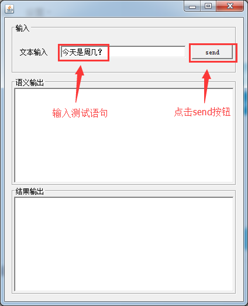
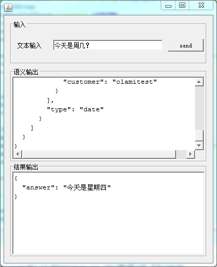
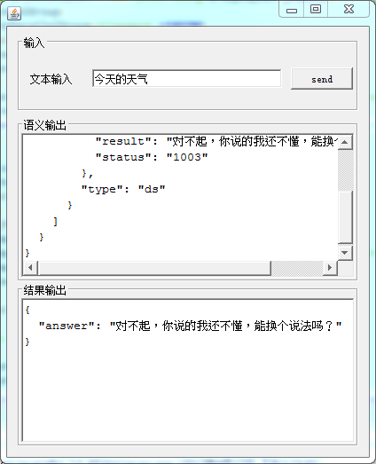

# 关于

> 该程序是在java1.7环境下编译的。如需运行该程序，请确保本地jdk版本>=1.7。

Demo.jar是一个可以直接运行的,具有简单图形化界面的示例小程序。

界面上主要有三部分，**文本输入框、语义输出框和结果输出框**。

用户可以通过在文本输入框输入想要测试的语句，点击“send”按钮，即可看到语义输出和结果输出的内容。

测试语句具体输出什么语义，是由开发者自己在NLI自然语言语义互动系统中指定的。
而结果输出又需要根据语义输出中的modifier和slot来决定具体的处理。

在该示例小程序中，我们只以内置的date模块来做展示。所以，目前只支持date模块所支持的相应说法。

# 开发者须知

在Demo的source code中，**NLIProcess.java**提供了如何调用该接口的一般方法。代码中使用到的各个字段，可以参考 [OLAMI 官网在线文档](http://olami.ai) 相关说明。

其中，需要注意两点。

1. 示例代码中的appkey和appsecret仅供示例程序使用，开发者在自己开发的过程中，需要更换为自己所创建的应用对应的key。

	> 关于如何获取appkey和appsecret，请参考 [OLAMI 官网在线文档](http://olami.ai) 相关说明。

2. 参数sign字段，需要进行MD5签名，在**MD5.java**中已经提供了MD5签名的方法。

## 如何根据语义分析结果输出最终结果

> 开发者通过自然语言语义理解 API 可以取得文本内容的语义分析结果。但是通过语义分析结果，需要怎样得到最终输出呢？

> 这就需要根据语义分析结果中输出的modifier和slot来决定了。

>> *NLI 系统目前内置且允许导入使用的模块均有对应的语义输出文档来描述modifier和slot的含义。开发者自定义的应用，可以根据自身需求来设计使用modifier和slot。*

我们现在依然以date模块作为示例结合source code来说明开发者该如何使用语义分析结果。（date模块的语义输出文档参照 [OLAMI 官网在线文档](http://olami.ai) 相关说明）

1. 解析语义分析结果。自然语言语义理解 API 返回的结果说明请参照 [OLAMI 官网在线文档](http://olami.ai) 相关说明。

	> **SemanticProcess.java**中的**parseSemantic()**方法实现了简单的语义分析结果解析，仅供开发者参考，Semantic和Slot类开发者也可以根据自身需求重新定义。

2. 根据status字段判断返回的语义是否正确。

	> status字段的描述请参考 [OLAMI 官网在线文档](http://olami.ai) 相关说明。

3. 当返回状态正常的时候，根据解析出来的modifier判断输入语句的意图。

	> 例如输入语句为**"上海八点是纽约几点"**时，可以看到modifier中包含*"query\_time"*，根据date语义输出文档可以知道，该modifier表示的意图为查询时间，因此我们可以交由处理查时间的模块进行处理。

4. 结合slot信息输出最终结果。

	> 根据date语义输出文档，可以看出来，“看一下时间”同样也会返回"query\_time"这个modifier。但是这时候，是不包含slot值的，所以直接输出当前时间即可。而对于“上海八点是纽约几点”，其中包含了3个slot，这时候就需要将place\_src（上海）的time（八点）进行时区转换，转换到place\_dst（纽约）所对应时区的时间。

5. 根据上一步，我们就已经可以得到最终的输出结果“上海八点是纽约20点”了。

	> 同一句输入的内容在不同背景下，完全可以输出两种不同的答案。例如：“帮我放刘德华的歌”，这时候，开发者返回的最终结果可以是播放刘德华的歌曲，也可以返回如下结果“你需要听刘德华的哪首歌呢？”。具体输出什么内容，需要开发者根据自己的应用场景决定。该示例小程序主要是给开发者展示如何使用语义分析结果。

	> date的所有语义解析都已经在**SemanticProcess.java**的process()方法里面实现。开发者可以对照date语义输出文档查阅。

## Source Code 说明

1. **NewJFrame.java** 为该小程序的入口。主要功能是界面的显示和控制。
2. **NLIProcess.java** 提供了如何调用自然语言语义理解 API 接口的一般方法。
3. **SemanticProcess.java** 中包含了解析语义分析结果（parseSemantic）的方法和根据语义获取最终结果（process）的方法。
4. **MD5.java** 中实现了MD5签名方法，供给生成sign字段使用。
5. **TimeConvertor.java** 中包含了各种计算时间的方法，包括时区转换、计算农历日期、计算节日和节气等。
6. **TimezoneInfo.java** 中包含了一些城市和时区对应关系的信息。其中国内城市，统一以北京时间为准，国外城市也只包含部分城市。
7. **DateUtil.java** 中是一些时间结构，仅供计算时间的各方法调用。
8. **Holiday.java** 用于计算和保存节假日信息。
9. **HolidayInfo.java**定义了节假日信息保存的格式。
